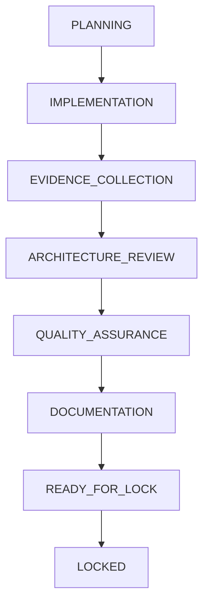

# Sprint Lifecycle

## Governing Authority
All actions are strictly governed by the AI SDLC Constitution:
[.ai-sdlc/constitution/AI-SDLC-v1.0.md](../constitution/AI-SDLC-v1.0.md)

## Sprint State Machine
The AI SDLC officially adopts a workflow-driven engineering organization. Every sprint must follow this immutable lifecycle. No stage may be skipped.

## State Transitions
1. **PLANNING:** Chief Architect designs the sprint plan.
2. **IMPLEMENTATION:** Implementation Engineer writes the code and produces the Implementation Report.
3. **EVIDENCE_COLLECTION:** Evidence Engineer gathers objective metrics and produces the Evidence Report.
4. **ARCHITECTURE_REVIEW:** Architecture Reviewer verifies structural compliance.
5. **QUALITY_ASSURANCE:** QA Engineer verifies runtime and build stability.
6. **DOCUMENTATION:** Documentation Engineer produces final summaries and manifests.
7. **READY_FOR_LOCK:** Engineering Manager confirms all artifacts exist and all reviews have passed.
8. **LOCKED:** The sprint is committed, pushed, and closed. No further changes allowed.

## Enforcement
The Engineering Manager is responsible for enforcing this lifecycle and preventing any backward transitions (except via the defined Re-Review workflow).
